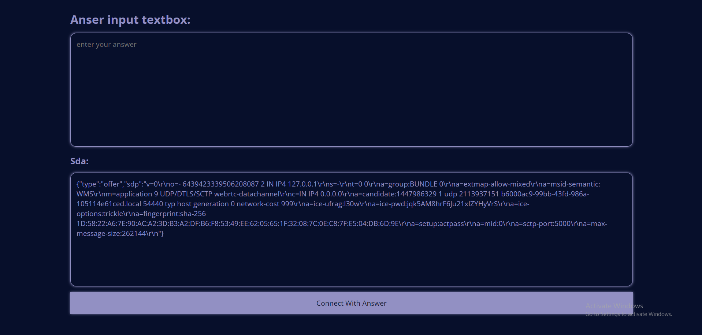
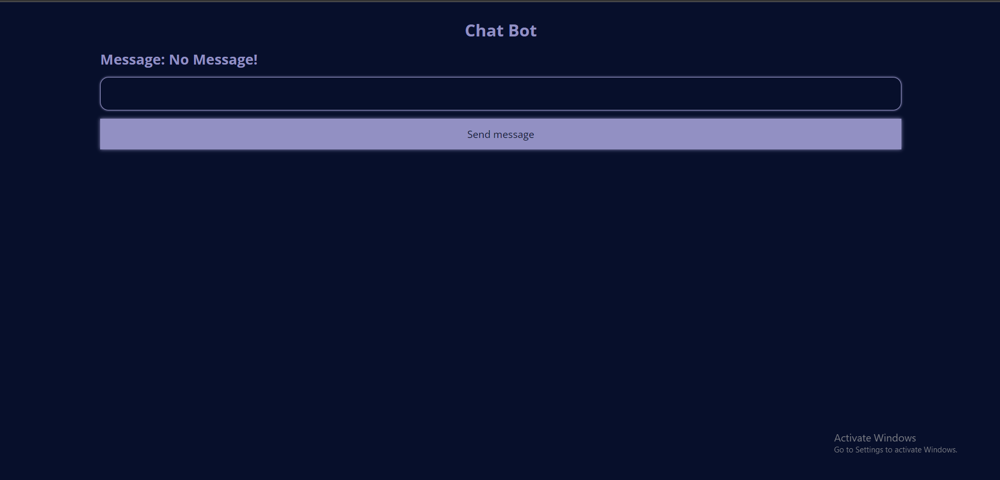

# WebRTC Chat Application

This project is a simple web-based chat application using WebRTC API to connect and chat between two clients. The app is built using HTML, CSS, and JavaScript.

## Table of Contents
- [Features](#features)
- [Getting Started](#getting-started)
- [Usage](#usage)
- [Code Overview](#code-overview)
- [Screenshots](#screenshots)
- [License](#license)

## Features
- Real-time chat between two clients.
- Peer-to-peer connection using WebRTC.
- Simple and user-friendly interface.

## Getting Started

### Prerequisites
To run this project, you need a basic web server to serve the HTML file. You can use any simple HTTP server like `http-server` in Node.js, or simply open the HTML file directly in your browser.

### Installation
1. Clone the repository or download the ZIP file:
   ```sh
   git clone https://github.com/yourusername/webrtc-chat.git
   ```
2. Navigate to the project directory:
   ```sh
   cd webrtc-chat
   ```
3. Open the `index.html` file in your web browser.

## Usage
1. Open the `index.html` file in two different browser windows or tabs.
2. In the first window, copy the SDP (Session Description Protocol) offer from the "Local Description" text box.
3. Paste the copied SDP offer into the "Remote Description" text box in the second window and click the "Send" button.
4. Copy the SDP answer from the "Local Description" text box in the second window.
5. Paste the copied SDP answer into the "Remote Description" text box in the first window and click the "Send" button.
6. Once the connection is established, you can send messages between the two clients.

## Code Overview

### JavaScript Code
The main logic of the WebRTC connection is implemented in the JavaScript code.
### Peer 1
```javascript
const localConnection = new RTCPeerConnection();
const dataConnection = localConnection.createDataChannel("dataChannel");

dataConnection.onmessage = (event) => {
  document.getElementById("client_message").innerText = event.data;
};

dataConnection.onopen = () => {
  alert("connection has been established!");
  document.getElementById("connection_portion").style.display = "none";
  document.getElementById("chat_portion").style.display = "block";
};

dataConnection.onclose = () => {
  document.getElementById("connection_portion").style.display = "block";
  document.getElementById("chat_portion").style.display = "none";
};

localConnection.onicecandidate = (event) => {
  document.getElementById("sda_part").innerText = JSON.stringify(
    localConnection.localDescription
  );
};

localConnection
  .createOffer()
  .then((offer) => localConnection.setLocalDescription(offer));

document.getElementById("send").addEventListener("click", () => {
  const answer = document.getElementById("answer").value;
  localConnection.setRemoteDescription(JSON.parse(answer));
});

document.getElementById("send_message").addEventListener("click", () => {
  const message = document.getElementById("message").value;
  dataConnection.send(message);
});
```
### Peer 2
```javascript
const remoteConnection = new RTCPeerConnection();

remoteConnection.onicecandidate = (event) => {
  document.getElementById("sda_part").innerText = JSON.stringify(
    remoteConnection.localDescription
  );
};

remoteConnection.ondatachannel = (event) => {
  const dataConnection = event.channel;
  remoteConnection.dataConnection = dataConnection;
  remoteConnection.dataConnection.onmessage = (event) => {
    document.getElementById("client_message").innerText = event.data;
  };
  remoteConnection.dataConnection.onopen = () => {
    alert("connection has been stablished!");
    document.getElementById("connection_portion").style.display = "none";
    document.getElementById("chat_portion").style.display = "block";
  };
  remoteConnection.dataConnection.onclose = () => {
    document.getElementById("connection_portion").style.display = "block";
    document.getElementById("chat_portion").style.display = "none";
  };
};

document.getElementById("send").addEventListener("click", () => {
  const offer = document.getElementById("offer").value;
  remoteConnection.setRemoteDescription(JSON.parse(offer));
  remoteConnection
    .createAnswer()
    .then((answer) => remoteConnection.setLocalDescription(answer))
    .then(() => {
      document.getElementById("sda_part").innerText = JSON.stringify(
        remoteConnection.localDescription
      );
    });
});

document.getElementById("send_message").addEventListener("click", () => {
  const message = document.getElementById("message").value;
  remoteConnection.dataConnection.send(message);
});

```

### HTML Structure
The HTML file contains two main sections: one for establishing the connection and another for the chat interface.

```html
<!DOCTYPE html>
<html lang="en">
<head>
  <meta charset="UTF-8">
  <meta name="viewport" content="width=device-width, initial-scale=1.0">
  <title>WebRTC Chat</title>
  <link rel="stylesheet" href="styles.css">
</head>
<body>
  <div id="connection_portion">
    <h2>Establish Connection</h2>
    <textarea id="sda_part" readonly></textarea>
    <input type="text" id="answer" placeholder="Enter Remote Description">
    <button id="send">Send</button>
  </div>

  <div id="chat_portion" style="display: none;">
    <h2>Chat</h2>
    <div id="client_message"></div>
    <input type="text" id="message" placeholder="Enter message">
    <button id="send_message">Send Message</button>
  </div>

  <script src="script.js"></script>
</body>
</html>
```


## Screenshots
### Establishing Connection


### Chat Interface


## License
This project is licensed under the MIT License. See the [LICENSE](LICENSE) file for more details.

---

Feel free to modify the content and structure of this README file to better suit your project's needs. Add the screenshots in the `screenshots` directory and reference them appropriately.